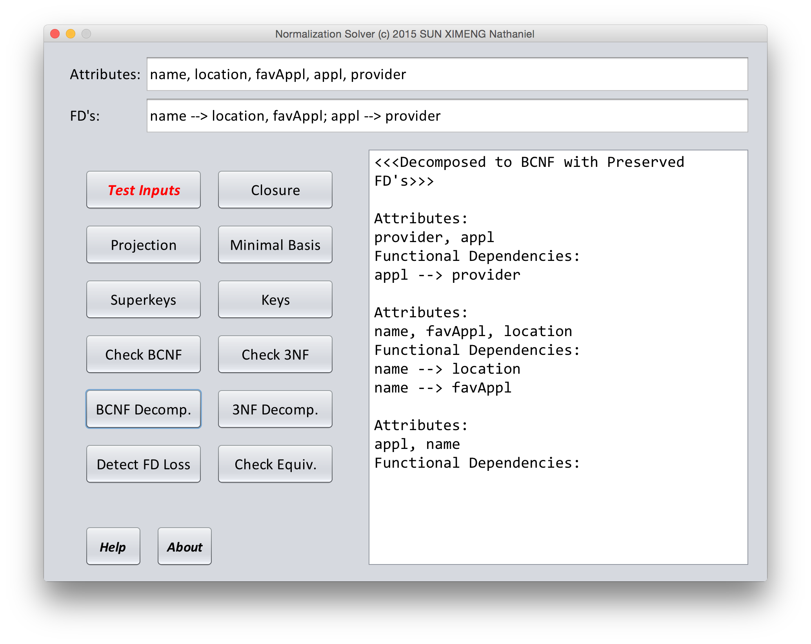

## [EXTRA] Java GUI App

#### <i><a href="https://raw.githubusercontent.com/nathanielove/Normalization-Solver/master/%5BGUI%5D%20Normalization%20Solver.jar">Download</a> an executable JAR app with GUI</i>

If the link above doesn't work, please download the jar file named as ```[GUI] Normalization Solver.jar``` from the root folder of this project.



## Installation

### Maven

```xml
<dependency>
  <groupId>io.bretty</groupId>
  <artifactId>database-normalization-solver</artifactId>
  <version>1.0</version>
</dependency>
```

### Downloads

* Download package [`database-normalization-solver-1.0.jar`](https://github.com/nathanielove/Database-Normalization-Solver/blob/master/database-normalization-solver-1.0.jar?raw=true)
* Download package, source and javadoc from: [Artifect Directory on Maven Central Repository](https://repo1.maven.org/maven2/io/bretty/database-normalization-solver/1.0/)

## Library Introduction
This is a open souce library together with an app with GUI to solve database normalization related problems, including:
  <ul>
  <li>Compute <b>closure</b></li>
  <li>Compute <b>minimal basis</b> (aka. minimal cover)</li>
  <li>Compute <b>projection</b></li>
  <li>Compute <b>keys</b> or <b>superkeys</b> of a relation</li>
  <li>Check which <b>normal form</b> a relation is in</li>
  <li><b>Decompose</b> a relation to <b>BCNF</b> or <b>3NF</b></li>
  <li>Detect possible <b>loss of functional dependency</b> (FD) during any decomposition</li>
  <li>Check if two sets of functional dependencies are <b>equivalent</b> to each other</li>
  </ul>
  
## User Guide
### Create an "Attribute" object
There are two equivalent ways to create an ```Attribute``` object.

```java
Attribute attr = new Attribute("userid");
```

or, 

```java
Attribute attr = Attribute.of("userid");
```

### Get a set of "Attribute" objects
```java
Set<Attribute> attrs = Attribute.getSet("name, age, gender");
```
The string in the parameter will be split by the comma ```,```, and then a ```java.util.Set``` of ```Attribute``` objects will be created according to the names in the string.

Please note that,
  <ul>
  <li>All white spaces are ignored.</li>
  <li>Everything is case-sensitive.</li>
  <li>A legal name of an ```Attribute``` object cannot contain comma ```,```, semicolon ```;```, or a substring of ```-->```.
  </ul>

### Create a "Functional Dependency" object

```java
FuncDep fd = FuncDep.of("name --> location, favApp");
```
This will create a ```FuncDep``` object that represents a functional dependency. In this case, ```fd``` means "name determines location and favApp". Generally, attribute(s) on the left side determines those on the right side.

### Get a set of "Functional Dependency" objects

```java
Set<FuncDep> fds = FuncDep.getSet("name --> location, favApp; app --> provider");
```

The attribute names in a functional dependency are separated by comma ```','```, and different functional dependencies are separated by semicolon ```';'```.

### Create a "Relation" object

There are multiple approaches to create a ```Relation``` object. Here only 2 of them are introduced.
The first approach is by using two expression strings. For example,

```java
Relation userInfo = new Relation("name, location, app, favApp, provider", "name --> location, favApp; app --> provider");
```

The first string specifies the attributes in this relation, while the second describes all the functional dependencies.

There is another approach to create exactly the same ```Relation``` object.

```java
Set<Attribute> attrs = Attribute.getSet("name, location, app, favApp, provider");
Set<FuncDep> fds = FuncDep.getSet("name --> location, favApp; app --> provider");
Relation userInfo = new Relation(attrs, fds);
```

### Use methods in "Algos" class

The ```Algos``` is a utility class. Methods in this class can be used to perform a lot of different computations related to functional dependencies and normalization of relations.

For example, to compute the minimal basis of a set of functional dependencies, we can simply write:

```java
Set<FuncDep> fds = FuncDep.getSet("C-->T;H,R-->C;H,T-->R;C,S-->G;H,S-->R");
Set<FuncDep> minimalBasis = Algos.minimalBasis(fds);
```

Another example is to remove all the trivial functional dependencies from a set.

```java
Set<FuncDep> fds = FuncDep.getSet("A-->B;A,B-->B;A,B-->A;C-->C;C,D,E,F-->C,D,F");
Algos.removeTrivial(fds);
```

Please note that some methods perform operations on the original set(s) in the parameter, while others will return the results in a different set, without modifying the original sets.

Here is a complete list of what the static methods in the `Algos` class can do:

* Compute closure
* Combine the right hand side of a set of functional dependencies
* Check if two sets of functional dependencies are equivalent
* Compute the minimun basis of a set of functional dependencies
* Compute superkeys and keys for a given set of attributes together with a set of functional dependencies
* Compute the projection of a set of functional dependencies on a set of attributes
* Remove redundent functional dependencies from a set
* Compute the functional dependencies that violate 3NF
* Compute the functional dependencies that violate BCNF
* Compute which functional dependencies are lost during a forced decomposition to BCNF or 3NF

### Decompose to BCNF or 3NF

One of the most powerful and convenient functionality of this library is to directly decompose a relation into BCNF or 3NF.
To decompose a relation directly to 3NF using the "Lossless Join & Dependency Preservation" algorithm:

```java
Relation rel = new Relation("A,B,C,D,E", "A-->B,C; C,D-->E; E-->A; B-->D");
Set<Relation> relsIn3NF = rel.decomposeTo3NF();
```

This will force the relation ```rel``` to be decomposed, no matter if it is already in 3NF or BCNF.

Also, decomposition to BCNF can be achieved by a similiar approach,

```java
Set<Relation> relsInBCNF = rel.decomposeToBCNF();
```

This direct decomposititon will cause possible loss of functional dependencies. To check if all the functional dependencies are preserved after the decomposition, simple call a method in the ```Algos``` class:

```java
Set<FuncDep> lost = Algos.checkLossyDecomposition(rel.getAttributes(), rel.getFuncDeps(), relsInBCNF);
```

All the lost functional dependencies will be stored in ```lost```. If ```lost``` is empty, it means all functional dependencies are preserved after the decomposition.

